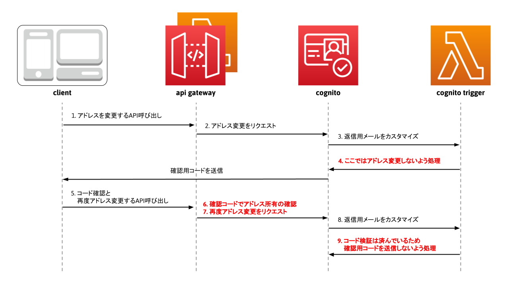

## **はじめに**

ここ最近、個人的に Cognito を触っているのですが、アドレス変更に**バグ？**が見受けられます。

ユーザープール属性の `email` を SDK で変更すると、変更前のアドレスに検証用コードが送信されこのコードを Cognito に返送することでアドレス変更が完了すると想定されるのですが、**このコード検証が未完了のまま変更後のアドレスでユーザープールに対する操作ができてしまいました。**

実は Github に 2018/06 から Issue が上がっているのですが、まだ対応されていないようです。

[Cognito: unable to login with email if user attempts to update email address](https://github.com/aws-amplify/amplify-js/issues/987)

Cognito 開発者もコメントしているのですが、私の拙い翻訳で解釈する限り、問題は認識しているが現状対応しきれていないらしいです、、、
ここまで放置するとそもそもリソースを割くつもりがないのではと勘ぐりたくなります。

これを回避するには、Coginito 側でコード検証を行ってくれないので、現状では自前で実装するしかありません。

**先ほどの Issue で回避策が提案されているのですが、AWS Amplify と 電話番号でのコード検証を行っているので、今回はこれを JavaScript-SDK と メールアドレスでのコード検証で実装してみました。**

## **問題点**

- SDK の [UpdateUserAttributes](https://docs.aws.amazon.com/cognito-user-identity-pools/latest/APIReference/API_UpdateUserAttributes.html) で `email` （ユーザー ID）を変更すると確認コードが受信されるが、Cognito へのコード検証を待たずに変更されたユーザー ID で Cognito への操作が可能
- 受信された確認コードを Cognito へ送信して `Confirm` する関数が見当たらず

## **対応策**

### **前提**

- **公式で推奨された方法ではありません**、**苦肉の策です**
- [低レベル API の JavaScript-SDK](https://docs.aws.amazon.com/AWSJavaScriptSDK/latest/AWS/CognitoIdentityServiceProvider.html#updateUserAttributes-property) で Cognito を操作（Amplify ではない）
- SDK 操作は全て API Gateway に閉じ込めて実装、クライアントは API を叩くだけ

### **イメージ**

本当に簡単に処理の流れをイメージ化。



### **流れ**

- アドレス（ユーザーネーム）を変更する API を呼び出し
- SDK の UpdateUserAttributes で属性変更を Cognito にリクエスト
- 属性変更時に[カスタムメッセージ Lambda トリガー](https://docs.aws.amazon.com/ja_jp/cognito/latest/developerguide/user-pool-lambda-custom-message.html)を Cognito から呼び出し
  **注意したいのがこの時点でアドレスは変更されていて、コード検証が未了なのですが変更後のアドレスでログイン等が行えてしまいます**
- コード検証が未了なので変更後のアドレスを無効化します、**Lambda トリガー内で変更前のアドレスに再び戻すことで変更後のアドレスを無効化**
- 確認用コードが変更前のアドレスに送信されるので、コード確認と再びアドレスを変更する API を呼び出し
- **SDK の [VerifyUserAttribute](https://docs.aws.amazon.com/cognito-user-identity-pools/latest/APIReference/API_VerifyUserAttribute.html) にて確認用コードとアクセストークンで `email`（標準属性）の所有確認を行うことで擬似的にコード検証を実行**
- 所有確認が成功したならば UpdateUserAttributes で再びアドレスを変更
- 属性変更に伴い[カスタムメッセージ Lambda トリガー](https://docs.aws.amazon.com/ja_jp/cognito/latest/developerguide/user-pool-lambda-custom-message.html)を呼び出し
- コード検証は完了しているのですが確認コードが再び送信されてしまうので、 **カスタムメッセージ Lambda トリガーにて送信処理を阻害**

## **実装内容**

適当に作っているので詳細な解説は省きます。参考 URL を載せるので参照してみてください。また、適宜自身の環境に読み替えてください。

### **Cognito の CFn サンプルテンプレート**

- [AWS::Cognito::UserPool](https://docs.aws.amazon.com/ja_jp/AWSCloudFormation/latest/UserGuide/aws-resource-cognito-userpool.html)

```yaml
AWSTemplateFormatVersion: 2010-09-09

Parameters:
  ServiceName:
    Type: String
    Default: "sample"
  CustomMessageTriggerName:
    Type: String
    Default: sample-update-user-attributes-confirm

Resources:
  UserPool:
    Type: AWS::Cognito::UserPool
    Properties:
      UserPoolName: !Sub ${ServiceName}-users
      AdminCreateUserConfig:
        AllowAdminCreateUserOnly: false
      UsernameAttributes:
        - email
      AutoVerifiedAttributes:
        - email
      Policies:
        PasswordPolicy:
          MinimumLength: 8
      AccountRecoverySetting:
        RecoveryMechanisms:
          - Name: verified_email
            Priority: 1
      LambdaConfig:
        CustomMessage: !Sub "arn:aws:lambda:${AWS::Region}:${AWS::AccountId}:function:${CustomMessageTriggerName}"
      Schema:
        - Name: email
          AttributeDataType: String
          DeveloperOnlyAttribute: false
          Mutable: true
          Required: true
        - Name: validated_email
          AttributeDataType: String
          DeveloperOnlyAttribute: false
          Mutable: true
          Required: false

  UserPoolClient:
    Type: AWS::Cognito::UserPoolClient
    Properties:
      ClientName: !Sub ${ServiceName}-users-client
      GenerateSecret: false
      RefreshTokenValidity: 3
      UserPoolId: !Ref UserPool
      ExplicitAuthFlows:
        - ADMIN_NO_SRP_AUTH
        - USER_PASSWORD_AUTH

  IdentityPool:
    Type: AWS::Cognito::IdentityPool
    Properties:
      AllowUnauthenticatedIdentities: false
      IdentityPoolName: !Sub ${ServiceName}-users
      CognitoIdentityProviders:
        - ClientId: !Ref UserPoolClient
          ProviderName: !Sub cognito-idp.${AWS::Region}.amazonaws.com/${UserPool}
```

### **サンプル API の SAM テンプレート**

```yaml
AWSTemplateFormatVersion: 2010-09-09
Transform: AWS::Serverless-2016-10-31

Parameters:
  ServiceName:
    Type: String
    Default: "sample"
  Environment:
    Type: String
    Default: "develop"
  UserPoolId:
    Type: String
    Default: "sample-pool-id"
    NoEcho: True
  AppClientId:
    Type: String
    Default: "sample-app-client-id"
    NoEcho: True

Globals:
  Function:
    Timeout: 30
    Environment:
      Variables:
        APP_CLIENT_ID: !Ref AppClientId

Resources:
  ServerlessApi:
    Type: AWS::Serverless::Api
    Properties:
      Name: !Sub ${ServiceName}-api
      StageName: !Ref Environment
      Auth:
        Authorizers:
          CognitoAuthorizer:
            UserPoolArn: !Sub arn:aws:cognito-idp:${AWS::Region}:${AWS::AccountId}:userpool/${UserPoolId}

  UpdateUserAttributes:
    Type: AWS::Serverless::Function
    Properties:
      FunctionName: !Sub ${ServiceName}-update-user-attributes
      Description: "update user attributes"
      Runtime: nodejs12.x
      CodeUri: update-attributes/
      Handler: app.handler
      Events:
        UpdateUserAttributesEvent:
          Type: Api
          Properties:
            RestApiId: !Ref ServerlessApi
            Path: update-attributes
            Method: POST

  UpdateUserAttributesConfirm:
    Type: AWS::Serverless::Function
    Properties:
      FunctionName: !Sub ${ServiceName}-update-user-attributes-confirm
      Description: "confirm updated user attributes"
      Runtime: nodejs12.x
      CodeUri: update-attributes-confirm/
      Handler: app.handler
      Events:
        UpdateUserAttributesConfirmEvent:
          Type: Api
          Properties:
            RestApiId: !Ref ServerlessApi
            Path: update-attributes/confirm
            Method: POST
```

### **アドレス変更（UpdateUserAttributes）**

- [Lambda で Cognito 認証](https://qiita.com/minmax/items/a36b081c073eff4a6533)
- [[ AWS 公式 ] UpdateUserAttributes](https://docs.aws.amazon.com/cognito-user-identity-pools/latest/APIReference/API_UpdateUserAttributes.html)

```js
"use strict";

const AWS = require("aws-sdk");
const cognito = new AWS.CognitoIdentityServiceProvider();

exports.handler = async (event, context, callback) => {
  let response = null;

  try {
    const accessToken = event["accessToken"];
    if (typeof accessToken === "undefined") {
      throw new Error("不正な操作が行われました");
    }

    const oldUserEmail = event["oldUserEmail"];
    if (typeof oldUserEmail === "undefined") {
      throw new Error("古いメールアドレスを入力してください");
    }

    const newUserEmail = event["newUserEmail"];
    if (typeof newUserEmail === "undefined") {
      throw new Error("新しいメールアドレスを入力してください");
    }

    const params = {
      AccessToken: accessToken,
      UserAttributes: [
        {
          Name: "email",
          Value: newUserEmail,
        },
        {
          Name: "custom:validated_email",
          Value: oldUserEmail,
        },
      ],
    };

    const result = await cognito
      .updateUserAttributes(params)
      .promise()
      .catch((error) => {
        throw error;
      });

    response = {
      statusCode: 200,
      headers: {
        "Content-Type": "application/json; charset=utf-8",
      },
      body: JSON.stringify({
        status: "success",
      }),
      isBase64Encoded: false,
    };
  } catch (err) {
    response = {
      statusCode: 400,
      headers: {
        "Content-Type": "application/json; charset=utf-8",
      },
      body: JSON.stringify({
        status: "failed",
        message: err.message,
      }),
      isBase64Encoded: false,
    };
  }

  return response;
};
```

### **コード検証とアドレス変更（UpdateUserAttributesConfirm）**

- [Cognito: unable to login with email if user attempts to update email address](https://github.com/aws-amplify/amplify-js/issues/987)

```js
"use strict";

const AWS = require("aws-sdk");
const cognito = new AWS.CognitoIdentityServiceProvider();

exports.handler = async (event, context, callback) => {
  let response = null;
  let params = null;
  let result = null;

  try {
    const accessToken = event["accessToken"];
    if (typeof accessToken === "undefined") {
      throw new Error("不正な操作が行われました");
    }

    const newUserEmail = event["newUserEmail"];
    if (typeof newUserEmail === "undefined") {
      throw new Error("不正な操作が行われました");
    }

    const confirmationCode = event["confirmationCode"];
    if (typeof confirmationCode === "undefined") {
      throw new Error("確認用コードを入力してください");
    }

    params = {
      AccessToken: accessToken,
      AttributeName: "email",
      Code: confirmationCode,
    };

    result = await cognito
      .verifyUserAttribute(params)
      .promise()
      .catch((error) => {
        throw error;
      });

    if (!Object.keys(result).length) {
      params = {
        AccessToken: accessToken,
        UserAttributes: [
          {
            Name: "email",
            Value: newUserEmail,
          },
          {
            Name: "custom:validated_email",
            Value: newUserEmail,
          },
        ],
      };

      result = await cognito
        .updateUserAttributes(params)
        .promise()
        .catch((error) => {
          throw error;
        });
    }

    response = {
      statusCode: 200,
      headers: {
        "Content-Type": "application/json; charset=utf-8",
      },
      body: JSON.stringify({
        status: "success",
      }),
      isBase64Encoded: false,
    };
  } catch (err) {
    response = {
      statusCode: 400,
      headers: {
        "Content-Type": "application/json; charset=utf-8",
      },
      body: JSON.stringify({
        status: "failed",
        message: err.message,
      }),
      isBase64Encoded: false,
    };
  }

  return response;
};
```

### **Lambda トリガーの SAM テンプレート**

```yaml
AWSTemplateFormatVersion: 2010-09-09
Transform: AWS::Serverless-2016-10-31

Parameters:
  ServiceName:
    Type: String
    Default: "sample"
  UserPoolId:
    Type: String
    Default: "sample-user-pool-id"
    NoEcho: True
  AppClientId:
    Type: String
    Default: "sample-app-client-id"
    NoEcho: True

Globals:
  Function:
    Timeout: 30
    Environment:
      Variables:
        USER_POOL_ID: !Ref UserPoolId

Resources:
  CustomMessage:
    Type: AWS::Serverless::Function
    Properties:
      FunctionName: !Sub ${ServiceName}-custom-message
      Description: "lambda trigger custom message."
      Runtime: nodejs12.x
      CodeUri: custom-message/
      Handler: app.handler
      Policies:
        - Version: "2012-10-17"
          Statement:
            - Effect: Allow
              Action: "*"
              Resource: !Sub arn:aws:cognito-idp:${AWS::Region}:${AWS::AccountId}:userpool/${UserPoolId}

  CustomMessagePermission:
    Type: AWS::Lambda::Permission
    Properties:
      FunctionName: !GetAtt CustomMessage.Arn
      Action: lambda:InvokeFunction
      Principal: cognito-idp.amazonaws.com
      SourceArn: !Sub arn:aws:cognito-idp:${AWS::Region}:${AWS::AccountId}:userpool/${UserPoolId}
```

### **カスタムメッセージ Lambda トリガー**

- [カスタムメッセージ Lambda トリガー](https://docs.aws.amazon.com/ja_jp/cognito/latest/developerguide/user-pool-lambda-custom-message.html)
- [Cognito: unable to login with email if user attempts to update email address](https://github.com/aws-amplify/amplify-js/issues/987)

```js
"use strict";

const AWS = require("aws-sdk");
const cognito = new AWS.CognitoIdentityServiceProvider();

const USER_POOL_ID = process.env.USER_POOL_ID;

exports.handler = async (event, context, callback) => {
  if (event.userPoolId === USER_POOL_ID) {
    if (event.triggerSource === "CustomMessage_UpdateUserAttribute") {
      const validated_email =
        event.request.userAttributes["custom:validated_email"];

      const params = {
        UserPoolId: event.userPoolId,
        Username: event.userName,
        UserAttributes: [
          {
            Name: "email_verified",
            Value: "true",
          },
          {
            Name: "email",
            Value: validated_email,
          },
        ],
      };

      const result = await cognito
        .adminUpdateUserAttributes(params)
        .promise()
        .catch((error) => {
          throw error;
        });

      if (validated_email === event.request.userAttributes.email) {
        throw new Error(
          "failed to prevent sending unnecessary verification code"
        );
      }
    }
  }

  callback(null, event);
};
```

## **おわりに**

ぺたぺたとサンプルを載せただけになっていますが、こんな問題が AWS でも起きるのだと衝撃を受けて共有した次第です。

にしてもこのコード未検証問題はいつ修正が入るのでしょうか、、、

Cognito はこれからも付き合っていこうと思っているので早く修正されると嬉しいです。
